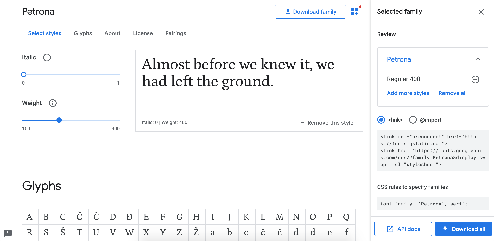

# Fici Sertligi

[Live Demo](https://brutdefut.github.io/ficisertligi/)

## Categories
- blended
- bourbons
- cask-strength
- highland
- islay-peated-smoky
- japan-asia
- lowland-irish
- speyside

## How to run
- `bundle exec jekyll server`

### How to update fonts
- in file `_layouts/default.html`, there are 2 `link` lines before `</head>` tag close.
    - update those 2 lines with what google font page offers.
- in file `assets/css/theme.scss`, there are some lines starting with `font-family:`.
    - update those lines with what google font offers under `CSS rules to specify families` section

